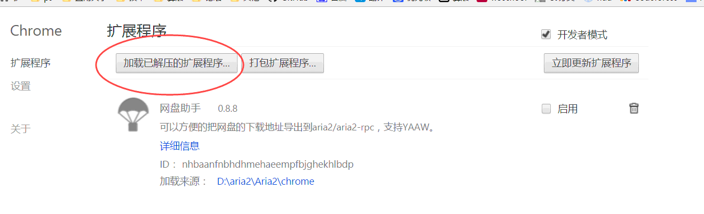

# Aria2
百度云资源使用Aria2来下载（Chrome浏览器的方法）  
   
1.首先到aria2官网（https://aria2.github.io/） download aria2    
   
2.然后将Chrome文件夹Clone到你的电脑中    
    
3.打开Chrome浏览器的扩展程序，点“加载已解压的扩展程序”， 选择刚Clone下来的文件夹
   
   
 
