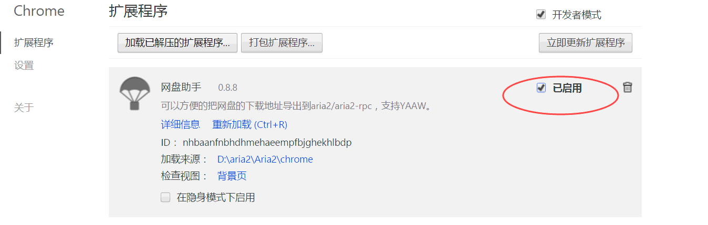
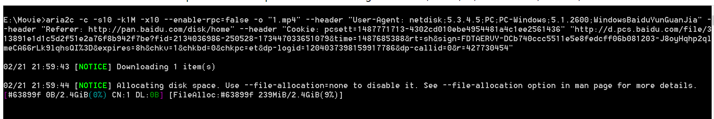

# Aria2
百度云资源使用Aria2来下载（Chrome浏览器的方法）  
   
1.首先到aria2官网（https://aria2.github.io/） download aria2， 并将aria2目录设置到环境变量（为了方便使用）    
   
2.然后将Chrome文件夹Clone到你的电脑中    
    
3.打开Chrome浏览器的扩展程序，点“加载已解压的扩展程序”， 选择刚Clone下来的文件夹
   
   
    
完成上述即可    
   
#如何下载    
示例如图:   
启用插件(由于Chrome对外来插件的限制比较大，所以在需要使用的时候再启用它吧)     
   
打开一个资源(启用了插件就会出现导出下载的按钮)    
  
点击“导出下载”，复制文本框内的地址，打开控制台，粘贴复制的内容即开始下载（由于前面设置了环境变量，所以直接复制使用即可。 同时下载下来的文件是在当前控制台的地址，如图中的：E:\Movie中）      
    
    