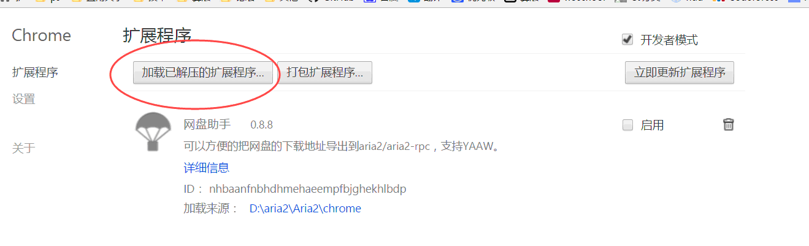
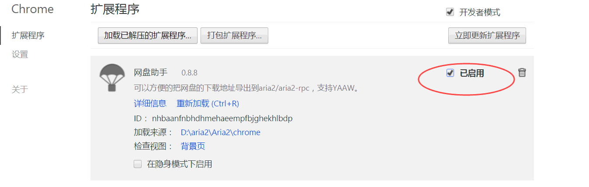
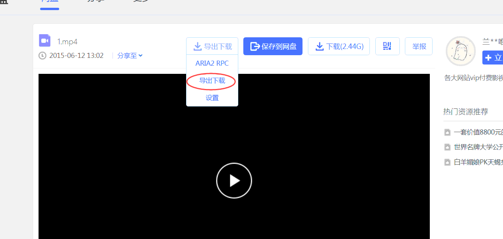
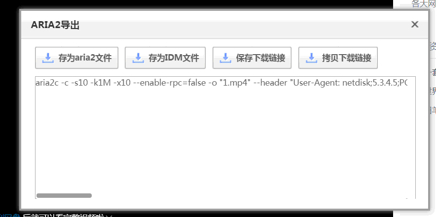
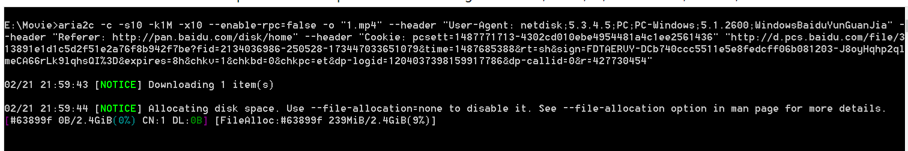
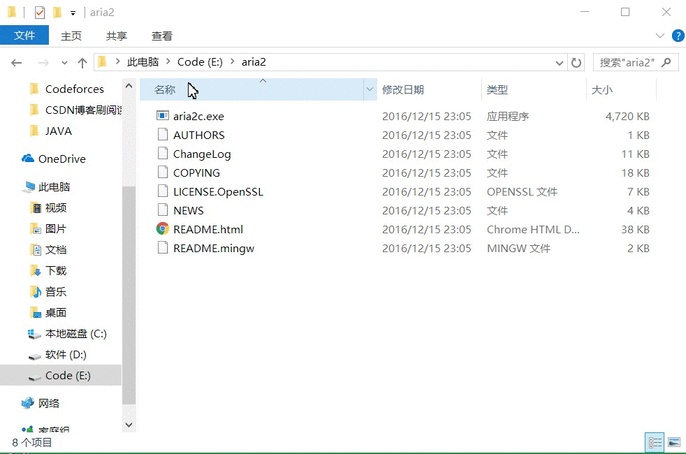

# 百度云资源使用Aria2来下载

* [支持的浏览器](#user-content-支持的浏览器)

* [配置插件](#user-content-配置插件)

* [如何进行下载](#user-content-如何进行下载)

* [配置环境变量的方法](#user-content-配置环境变量的方法)

* [解决 "请停用以开发者模式运行的扩展程序"](#user-content-解决-请停用以开发者模式运行的扩展程序)

# 支持的浏览器

### Chrome, Firefox, Edge 和 Safari：

* Chrome : Click **Settings** -> **Extensions** -> Check **Developer mode**-> **Load unpacked extension**, navigate to the `chrome` folder, click OK.
* Firefox : Open **about:debugging** in Firefox, click "Load Temporary Add-on" and navigate to the `chrome` folder, select `manifest.json`, click OK.
* Safari : Install Chrome or Firefox on Mac.
* Edge: You need at least Windows 10 build 14342
    1. Open [about:flags](about:flags), Check `Enable extension developer features`, Restart.
    2. Clone repo to a local read-write folder.
    3. Click **More(...)** -> **Extensions** -> **Load extension**, navigate to the `chrome` folder, click OK.

# 配置插件

***仅介绍 chrome 的中文配置，Firefox, Edge 和 Safari的配置请见上面英文***
   
1. 首先到github此处[Release](https://github.com/tatsuhiro-t/aria2/releases/)下载。 并将aria2目录设置到环境变量（为了方便使用）    

    * [设置环境变量方法](#user-content-配置环境变量的方法)

2. 然后本项目的"chrome"文件夹保存到你的电脑中(Chrome的插件,要保存,不能删除)    
    **“ chrome ” 这个插件的转自: https://github.com/acgotaku/BaiduExporter**  

    ***感谢  [acgotaku](https://github.com/acgotaku)***
    
3. 打开Chrome浏览器的扩展程序，点“加载已解压的扩展程序”， 选择本项目中的"chrome"文件夹
   

   
    
完成上述即可    
   
-----

# 如何进行下载    

 * 示例如图:   

    **1. 启用插件([关于Chrome提示"请停用以开发者模式运行的扩展程序.."的解决办法](#user-content-解决-请停用以开发者模式运行的扩展程序))**

       

    **2. 打开一个资源(启用了插件就会出现"导出下载"的按钮,若没有出现,则刷新当前页面)**

      

    **3. 点击“导出下载”，复制文本框内的地址，打开控制台，粘贴复制的内容即开始下载（由于前面设置了环境变量，所以直接复制使用即可。 同时下载下来的文件是在当前控制台的地址，如图中的：E:\Movie中）**

        

        

----

# 配置环境变量的方法

   
    
    

----

# 解决 "请停用以开发者模式运行的扩展程序"

**见博文**: **[[Chrome 71版本]彻底解决Chrome请停用以开发者模式运行的扩展程序https://vonsdite.cn/posts/d0e30452.html](https://vonsdite.cn/posts/d0e30452.html)**, 备用地址: https://blog.csdn.net/VonSdite/article/details/86493684  
