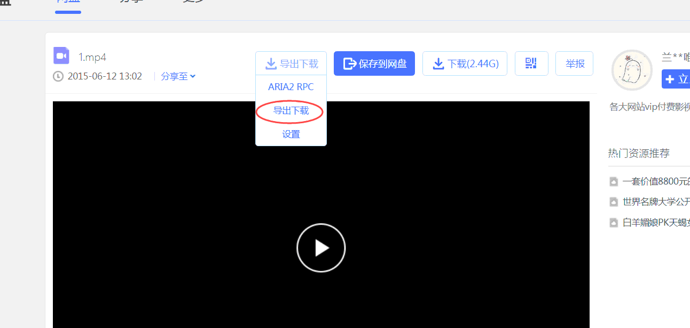
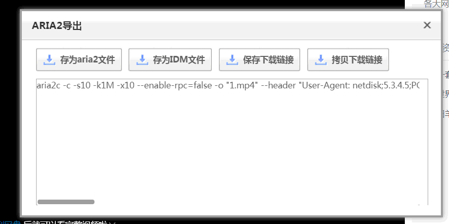

# 百度云资源使用Aria2来下载（Chrome浏览器的方法）

* [准备阶段](#user-content-准备阶段)

* [如何进行下载](#user-content-如何进行下载)

* [配置环境变量的方法](#user-content-配置环境变量的方法)

* [解决 "请停用以开发者模式运行的扩展程序"](#user-content-解决 "请停用以开发者模式运行的扩展程序)

# 准备阶段
   
1. 首先到aria2官网（https://aria2.github.io/） download aria2， 并将aria2目录设置到环境变量（为了方便使用）    
   
    * [设置环境变量方法](#jumpThird)

2. 然后本项目的"chrome"文件夹保存到你的电脑中(Chrome的插件,要保存,不能删除)    
    
3. 打开Chrome浏览器的扩展程序，点“加载已解压的扩展程序”， 选择本项目中的"chrome"文件夹
   
   
    
完成上述即可    
   
-----

# 如何进行下载    

 * 示例如图:   

    **1. 启用插件([关于Chrome提示"请停用以开发者模式运行的扩展程序.."的解决办法](#jump1))**

       

    **2. 打开一个资源(启用了插件就会出现"导出下载"的按钮,若没有出现,则刷新当前页面)**

      

    **3. 点击“导出下载”，复制文本框内的地址，打开控制台，粘贴复制的内容即开始下载（由于前面设置了环境变量，所以直接复制使用即可。 同时下载下来的文件是在当前控制台的地址，如图中的：E:\Movie中）**

        

        

----

# 配置环境变量的方法

   
    
    

----

# 解决 "请停用以开发者模式运行的扩展程序"

* 找到 Chrome的 chrome.dll所在的目录

    

* 将本项目中的 "chrome请停用开发者模式弹窗关闭" 复制到该目录下, **并以管理员方式运行chrome.dll.bat**, 运行完即可解决问题